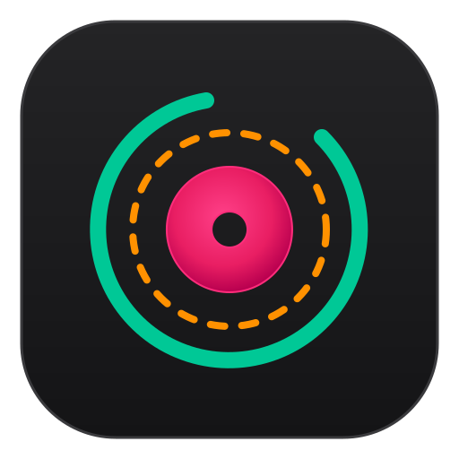

<p align="center">
  
</p>

<h1 align="center">LocalTune</h1>

<p align="center">
  <strong>Self-hosted audio downloader & delta-sync engine for Spotify and YouTube.</strong>
</p>

<p align="center">
  
  
  
  
</p>

---

LocalTune is a self-hosted, lightweight web application for managing and downloading audio tracks from Spotify and YouTube. Built with FastAPI, HTMX, TailwindCSS, and SQLite, it offers a beautifully simple interface to securely delta-sync your favorite playlists directly to your local storage.

## Features

- **Spotify & YouTube Support:** Powered by `spotdl` and `yt-dlp`.
- **Delta-Sync:** Tracks are intelligently checked against a local SQLite database to prevent re-downloading duplicates.
- **Live Progress Dashboard:** Watch your downloads queue, process, and complete in real-time via seamless HTMX polling.
- **Host File Permissions:** Background processes automatically fix file permissions on Linux so your host machine can effortlessly manage the downloaded MP3s.
- **Telegram Notifications:** Get instantly notified via Telegram when a batch download completes.
- **Secure Settings:** Configure API keys and Bot Tokens securely via a database-backed Settings panel on the web app.

## Prerequisites

- **Windows Desktop:** **Zero prerequisites** — download the all-in-one standalone bundle (`LocalTune-Windows-x64.zip`), extract, and run! No Docker, Python, or Git required.
- **Linux / NAS / Home Server:** **Docker & Docker Compose** installed on your host machine.
- (Optional) Telegram Bot Token and Chat ID for notifications.
- (Optional) Spotify Client ID and Secret for robust playlist extraction.

## Installation & Setup

1. **Clone the repository:**
   ```bash
   git clone https://github.com/Reimaris/LocalTune.git
   cd LocalTune
   ```

2. **Start the application:**
   Using Docker Compose, start the single-container LocalTune application:
   ```bash
   docker compose up -d
   ```

3. **Access the Web App:**
   Open your browser and navigate to:
   `http://localhost:8000`

4. **Configure Settings:**
   Head to the **Settings** tab in the navigation bar to configure your Telegram Notification tokens and Spotify API credentials.

## Usage

Simply paste a Spotify Track/Playlist URL or a YouTube Video/Music URL into the Dashboard's input field and click **Download**. 
LocalTune will queue the job in the background, extract the metadata, cross-reference the local SQLite database, and download any missing MP3s into the `downloads/` directory.

### Custom Download Directory
By default, LocalTune saves downloads to the `./downloads` directory relative to your `compose.yaml` file. 

If you want downloads saved to an arbitrary folder on your host machine (such as a separate hard drive, external SSD, or existing music library), simply change the volume mount on the left side of `./downloads:/downloads` in `compose.yaml`:

```yaml
services:
  localtune:
    ...
    volumes:
      - ./config:/app/config
      # Replace ./downloads with your desired host path:
      - /mnt/media/Music:/downloads       # Linux / macOS
      # - D:/Music:/downloads            # Windows
```

## Windows Standalone System Tray Launcher
 
For Windows users, LocalTune is available as a self-contained, standalone desktop bundle (`LocalTune-Windows-x64.zip`) featuring a zero-click system tray launcher (`LocalTune.exe`). It requires **zero prerequisites** (no Docker Desktop, no Python, no Git). Simply extract and double-click `LocalTune.exe`—the server boots in the background, parks in your system tray, opens your browser dashboard automatically, and provides one-click access to downloads, logs, and in-place updates.

**Download & Install:**  
👉 **[Read the Complete Windows Installation Guide](WINDOWS_INSTALLATION.md)** for step-by-step instructions.

*(For developers wanting to build the launcher from source: Navigate to the `windows_launcher` directory and run `build.bat`)*

## Architecture

- **Frontend:** HTML, Vanilla TailwindCSS, HTMX, AlpineJS.
- **Backend:** Python 3.12, FastAPI, SQLAlchemy (SQLite), FastAPI BackgroundTasks.
- **Core Extractors:** `spotdl`, `yt-dlp`, bundled `ffmpeg` & `deno`.
- **Windows Standalone Bundle:** Python 3.12 embedded runtime, static `ffmpeg` & `deno` binaries, `pystray` system tray supervisor (`LocalTune.exe` PyInstaller executable).
- **Containerization (Linux / NAS):** Single-container Docker image hosted on GitHub Container Registry (`ghcr.io/reimaris/localtune:latest`).

## License
 
GNU Affero General Public License v3 (AGPLv3). See [LICENSE](LICENSE) for details.
